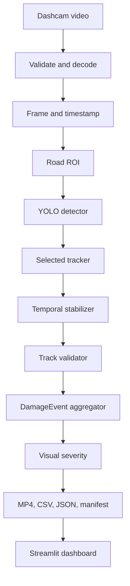
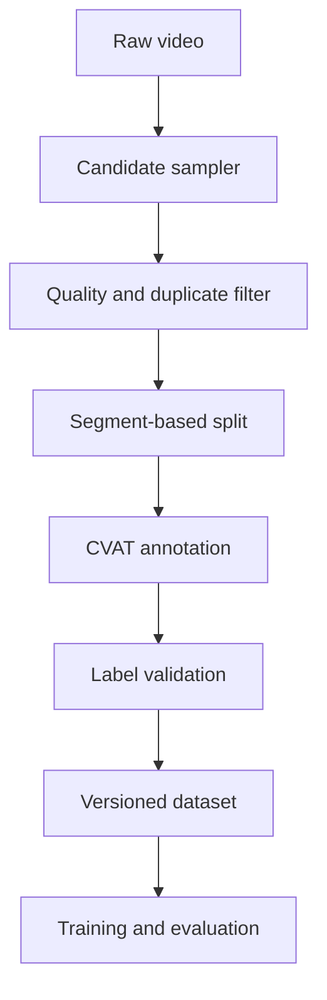
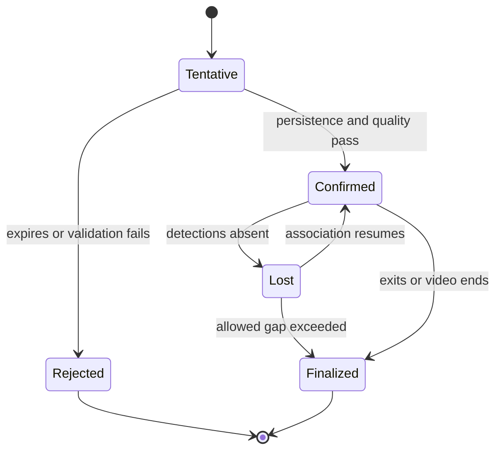

# System Architecture

## 1. Architectural goals

The system must separate computer-vision observations from research decisions. A model produces detections; a tracker associates observations; an aggregator decides whether they form a unique physical-damage event. This separation makes counting errors measurable and prevents raw tracker behavior from defining the final report.

## 2. End-to-end flow



The dataset-preparation path is separate from production inference:



## 3. Component responsibilities

| Component | Owns | Must not own |
|---|---|---|
| Video reader | decoding, metadata, frames, timestamps | detection or output decisions |
| ROI filter | normalized polygons and inclusion decisions | class correction |
| Detector adapter | model loading and per-frame detections | persistent IDs or unique counts |
| Tracker adapter | track association and raw IDs | final event count |
| Stabilizer | EMA boxes/confidence and short hold state | permanent duplicate merging |
| Track validator | confirmation/rejection rules | report rendering |
| Event aggregator | event lifecycle and fragment merge | detector inference |
| Severity estimator | zone-based visual score/label | physical-unit claims |
| Renderer | overlays and encoded output | scientific metrics |
| Reporter | CSV, JSON, summary, manifest | re-running inference |
| Dashboard | orchestration and presentation | duplicate pipeline logic |

## 4. Core data contracts

### FramePacket

```yaml
video_id: string
frame_index: integer          # zero-based
timestamp_ms: integer
image_bgr: ndarray            # runtime only
width: integer
height: integer
is_sampled: boolean
```

Timestamp should be derived from decoder timing when reliable. A frame-index/FPS fallback must be documented in the manifest.

### DetectionObservation

```yaml
frame_index: integer
timestamp_ms: integer
class_id: integer
class_name: string
confidence: float
bbox_xyxy_px: [float, float, float, float]
bbox_xyxy_norm: [float, float, float, float]
roi_valid: boolean
```

### TrackObservation

```yaml
raw_track_id: integer
detection: DetectionObservation
smoothed_bbox_xyxy_px: [float, float, float, float]
smoothed_confidence: float
observation_kind: detected | held
track_age_frames: integer
missed_frames: integer
```

Held observations are for display/continuity. They must not be treated as direct detector evidence.

### TrackSummary

```yaml
raw_track_id: integer
status: tentative | confirmed | lost | rejected | finalized
dominant_class_id: integer
class_vote_ratio: float
first_frame: integer
last_frame: integer
observed_frames: integer
held_frames: integer
mean_detected_confidence: float
max_detected_confidence: float
representative_observation: TrackObservation
rejection_reasons: [string]
```

### DamageEvent

```yaml
event_id: string
source_track_ids: [integer]
class_id: integer
class_name: string
first_frame: integer
last_frame: integer
representative_frame: integer
first_timestamp_ms: integer
last_timestamp_ms: integer
representative_timestamp_ms: integer
observed_frame_count: integer
mean_confidence: float
max_confidence: float
severity_score: float | null
severity_label: low | medium | high | unknown
roi_valid: boolean
merge_evidence: [object]
```

## 5. Event lifecycle



### Confirmation evidence

A tentative track can be confirmed only when all configured gates pass:

- minimum number of directly detected observations;
- mean detected confidence;
- dominant-class vote ratio;
- road ROI validity;
- plausible screen-space trajectory;
- minimum/maximum box-size sanity checks.

### Fragment merging

Track fragments may be merged only when evidence supports the same physical defect. Candidate evidence includes:

- same dominant class;
- short time separation;
- compatible end/start image position and motion direction;
- compatible size trend;
- no overlapping simultaneous observations that prove two distinct defects.

Every merge must retain all source track IDs and its feature scores. V1 should prefer false non-merges over aggressive merges that combine separate nearby defects.

## 6. ROI and measurement zones

Coordinates are stored as normalized values so configurations survive resolution changes.

```yaml
road_roi:
  polygon: [[0.10, 0.98], [0.90, 0.98], [0.64, 0.45], [0.36, 0.45]]
  acceptance_point: bottom_center

severity_zone:
  polygon: [[0.20, 0.88], [0.80, 0.88], [0.67, 0.62], [0.33, 0.62]]
```

These coordinates are examples only. They must be calibrated after inspecting the actual dashcam video.

The representative severity observation should be the high-confidence directly detected observation closest to the target line inside the measurement zone. If no valid observation exists, severity is `unknown`; the system must not extrapolate a confident label.

## 7. Configuration hierarchy

Recommended configuration files:

```text
configs/
  base.yaml
  dataset.yaml
  detector/
    yolov8s.yaml
    yolo26s.yaml
  tracker/
    bytetrack.yaml
    botsort.yaml
  video/
    teacher_dashcam.yaml
```

Resolution order:

```text
base -> component config -> video config -> CLI override
```

The resolved configuration must be saved with every run.

## 8. Proposed repository structure

```text
road-damage-detection/
  AGENTS.md
  README.md
  pyproject.toml
  .gitignore
  configs/
  docs/
  src/road_damage/
    cli.py
    config.py
    schemas.py
    video/
    dataset/
    detection/
    tracking/
    aggregation/
    severity/
    rendering/
    reporting/
    app/
  tests/
    unit/
    integration/
    fixtures/
  scripts/
  data/
    manifests/
  experiments/
  outputs/
```

Raw videos, extracted images, annotations under active editing, model weights, and generated outputs should be ignored by Git unless a tiny permission-safe fixture is intentionally committed.

## 9. Main commands to support

Exact CLI syntax may evolve, but the final application should expose equivalent capabilities:

```bash
road-damage inspect-video --input VIDEO
road-damage sample-frames --input VIDEO --config CONFIG
road-damage validate-dataset --dataset DATASET_YAML
road-damage train --config EXPERIMENT_YAML
road-damage evaluate --run RUN_DIR
road-damage process-video --input VIDEO --model MODEL --config CONFIG
road-damage dashboard
```

## 10. Failure and checkpoint design

- Validate model, video, output directory, free space, and codec before inference.
- Write reports atomically through temporary paths.
- Flush event/intermediate records at configurable intervals.
- Preserve a partial-run manifest on failure.
- Never overwrite an existing run directory unless the user passes an explicit safe option.
- End-of-video finalization must close every active confirmed track.

## 11. Performance boundaries

V1 is an offline pipeline. Processing FPS must be measured, but real-time speed is not required. Decode, inference, tracking, rendering, and encoding timings should be collected separately so bottlenecks are explainable.

