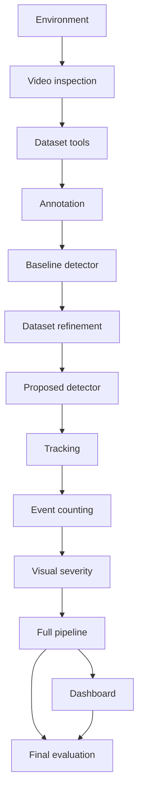

# Project Roadmap and Start Checklist

## 1. Recommended milestone sequence

| Milestone | Main result | Estimated effort* |
|---|---|---:|
| M0 | Repository, environment, CLI/test skeleton | 2-3 days |
| M1 | Full video inspection and calibrated sampling plan | 1-2 days |
| M2 | Frame sampler, quality filter, manifest, split audit | 4-6 days |
| M3 | Pilot annotation and dataset v0.1 | 1-2 weeks |
| M4 | YOLOv8s baseline and error analysis | 4-7 days |
| M5 | Active-learning expansion and frozen dataset v1.0 | 1-2 weeks |
| M6 | YOLO26s experiment and detector selection | 4-7 days |
| M7 | ByteTrack/BoT-SORT and stabilization | 5-8 days |
| M8 | Unique event counting and manual clip ground truth | 1-2 weeks |
| M9 | Measurement-zone visual severity | 4-6 days |
| M10 | Full-video reporting and performance hardening | 5-8 days |
| M11 | Streamlit dashboard | 3-5 days |
| M12 | Final evaluation, report, slides, and demo | 1-2 weeks |

`*` Planning estimates depend heavily on annotation time and GPU access; revise after M1.

## 2. Dependency map



## 3. Immediate start checklist

### Inputs

- [ ] Original one-hour dashcam video is safely backed up.
- [ ] Permission to use the video for coursework is recorded.
- [ ] A representative 2-5 minute development clip can be created without altering the source.
- [ ] Available computer specifications and GPU plan are recorded.
- [ ] Required submission date and college report format are known.

### Repository

- [ ] `AGENTS.md` copied to repository root.
- [ ] Other documentation copied to `docs/`.
- [ ] Raw data, model weights, runs, outputs, and secrets ignored by Git.
- [x] Approved Python 3.12.10 baseline environment created and verified.
- [ ] FFmpeg and GPU/CPU checks pass.
- [ ] Initial Git commit created.

### Research discipline

- [ ] Four classes accepted.
- [ ] V1/deferred scope accepted.
- [ ] No final metrics written in advance.
- [ ] Test segments frozen before model tuning.
- [ ] Experiment naming and manifest rules accepted.

## 4. Milestone exit questions

Do not advance unless the answer is yes:

### M1 video inspection

- Do we know actual FPS, resolution, duration, camera geometry, and major conditions?
- Do all four proposed classes actually appear often enough to attempt training/evaluation?
- Is the manual ROI defensible?

### M3 annotation

- Are ambiguous class boundaries resolved?
- Are test labels independently reviewed?
- Is temporal leakage prevented?

### M6 detector selection

- Were both detectors compared fairly?
- Is the selected model justified by measured quality, speed, and compute?

### M8 event counting

- Is event ground truth available for representative clips?
- Does the aggregator keep audit evidence for rejected/merged tracks?
- Is counting better than frame-level counting?

### M10 full pipeline

- Can the full video run without editing code?
- Are partial failures recoverable?
- Can every report row be checked at a timestamp?

### M12 final outputs

- Can every number be regenerated?
- Are limitations stated honestly?
- Are privacy and license obligations satisfied?

## 5. Stop conditions

Pause and revisit scope if:

- a V1 class has too few reliable examples after inspection;
- annotations cannot be made consistent;
- only random frame splitting would make metrics look acceptable;
- physical severity is requested without suitable ground truth/sensors;
- proprietary deployment conflicts with selected software licensing;
- the dashboard is being built while the CLI pipeline is still unstable;
- test data has been used repeatedly for tuning.

## 6. Suggested weekly status format

```text
Completed:
- verifiable artifacts and tests

Measured:
- real counts/metrics only

Blocked:
- specific missing input or failure

Next:
- one milestone-sized objective

Risks/decisions:
- scope, data, compute, privacy, or license changes
```

## 7. Final hand-in checklist

- [ ] Source repository with setup instructions.
- [ ] Dataset documentation and manifest; raw/private media excluded unless explicitly permitted.
- [ ] Model training and evaluation configs.
- [ ] Final weights or lawful reproducibility instructions.
- [ ] Annotated demonstration video.
- [ ] CSV and JSON event reports.
- [ ] Detection, tracking/counting, severity, and runtime results.
- [ ] Error analysis and limitations.
- [ ] Dashboard or recorded demo.
- [ ] Dissertation/report.
- [ ] Presentation slides.
- [ ] References and license notices.
